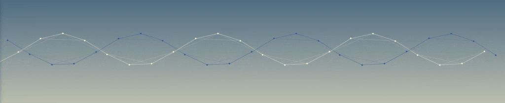

---

 
You might know me as ***ishiigos*** from my other profiles, or maybe not, in which case... nice to meet you ♡

<H3> A little about me: </H3>
✧ Graduate in STEM disciplines:
 
&emsp;&emsp;✦ Master's in Bioinformatics & Systems Biology from the University of Manchester
 
&emsp;&emsp;✦ Bachelor's in Microbial & Food Technology from Panjab University
  
✧ 👩🏻‍💻 Actively looking for roles in Bioinformatics, Software Development, Data Analysis. I am eager to contribute to innovative projects.
  
✧ 🖥️ Currently working on multiple projects in pursuit of learning and keeping up with advancements in software and bioinformatics
  
✧ 🔬 Interests: 
<ul>
  <li>Evolutionary biology mechanisms,</li>
  <li>Artificial Intelligence and Machine Learning in Biology,</li>
  <li>Exploring biological data patterns,</li>
  <li>Role of bioinformatics for advancements in genomics and medicine.</li>
  <li>Biological systems,</li> 
</ul>

<h2>Skills</h2>
<ul>
  <li><b>Programming Languages:</b> Python(numpy, scikit-learn, matplotlib, pandas, NetworkX), R, Unix, Linux commands, Bash, Shell scripting</li>
  <li><b>Machine Learning:</b> Supervised and Unsupervised learning, PCA, Logistic and Linear Regression, Clustering, Decision Trees, Neural Networks</li>
  <li><b>Web and Mobile Development:</b> HTML, CSS, TypeScript, JavaScript, ReactNative</li>
  <li><b>Data Preparation:</b> Web scraping, Data wrangling, Data cleaning</li>
  <li><b>Version Control:</b> Git</li>
  <li><b>Bioinformatics:</b> Databases, BLAST, NGS analysis, Phylogenetic analysis, sequence analysis, network analysis, network and metabolic modelling</li>
  <li><b>Statistics / Data Analysis:</b> R Studio, data visualization, statistical modelling </li>
  <li><b>Next Generation Sequencing:</b> Illumina, Nanopore, PacBio reads, FASTQ quality control, Genome Assembly, Sequence alignment, Gene Annotation, Gene Mapping, Visualization</li>
  <li><b>Collaboration and Soft skills:</b> Active listening, teamwork, time management.</li>
</ul>
&emsp;&emsp;&emsp;&emsp;&emsp;&emsp;&emsp;&emsp;&emsp;&emsp;&emsp;&emsp;&emsp; 

### 🧠 Skills  

### 🧠 Skills  

## 🧠 Skills  

### 🧠 Skills  

### 🧠 Skills  

### 🔬 Bioinformatics & Data Science  

# New:
# Hi, I'm Ishita 👋

## 🧠 Skills

### 🔹 Programming Languages  

---

### 🔹 Machine Learning  

---

### 🔹 Web and Mobile Development  

---

### 🔹 Data Preparation  

---

### 🔹 Version Control  

---

### 🔹 Bioinformatics  

---

### 🔹 Statistics / Data Analysis  

---

### 🔹 Next Generation Sequencing  

---

### 🔹 Collaboration & Soft Skills  

---

## 📊 GitHub Stats  

<!--
<h2 align="center">🚀 Technical & Professional Skills</h2>

<h3>🖥️ Programming Languages</h3>

  
  
  
  
  
  

<h3>🤖 Machine Learning</h3>

  
  
  
  
  

<h3>🌐 Web & Mobile Development</h3>

  
  
  
  
  

<h3>🧹 Data Preparation</h3>

  
  
  

<h3>📁 Version Control</h3>

  

<h3>🧬 Bioinformatics</h3>

  
  
  
  
  

<h3>📊 Statistics / Data Analysis</h3>

  
  
  

<h3>🧬 Next Generation Sequencing</h3>

  
  
  
  
  
  
  
  
  

<h3>🤝 Collaboration & Soft Skills</h3>

  
  
  

--> 

<!-- ## 🚀 Technical & Professional Skills

### 🖥️ Programming Languages
| Python | R | Linux | Unix | Bash | Shell |
|--------|---|-------|------|------|-------|
|  |  |  |  |  |  |

### 🤖 Machine Learning
| Scikit-Learn | NumPy | Matplotlib | Pandas | NetworkX |
|--------------|-------|------------|--------|----------|
|  |  |  |  |  |

### 🌐 Web & Mobile Development
| HTML | CSS | TypeScript | JavaScript | React Native |
|------|-----|------------|------------|---------------|
|  |  |  |  |  |

### 🧹 Data Preparation
| Web Scraping | Data Wrangling | Data Cleaning |
|--------------|----------------|----------------|
|  |  |  |

### 📁 Version Control
| Git |
|-----|
|  |

### 🧬 Bioinformatics
| BLAST | NGS Analysis | Sequence Analysis | Phylogenetics | Metabolic Modelling |
|-------|--------------|-------------------|---------------|----------------------|
|  |  |  |  |  |

### 📊 Statistics & Data Analysis
| R Studio | Data Visualization | Statistical Modeling |
|----------|--------------------|----------------------|
|  |  |  |

### 🧬 Next Generation Sequencing
| Illumina | Nanopore | PacBio | FASTQ QC | Assembly | Alignment | Annotation | Gene Mapping | Visualization |
|----------|----------|--------|----------|----------|-----------|------------|--------------|---------------|
|  |  |  |  |  |  |  |  |  |

### 🤝 Collaboration & Soft Skills
| Active Listening | Teamwork | Time Management |
|------------------|----------|------------------|
|  |  |  | -->

<!-- 

**ishiigos/ishiigos** is a ✨ _special_ ✨ repository because its `README.md` (this file) appears on your GitHub profile.

Here are some ideas to get you started:

- 🔭 I’m currently working on ...
- 🌱 I’m currently learning ...
- 👯 I’m looking to collaborate on ...
- 🤔 I’m looking for help with ...
- 💬 Ask me about ...
- 📫 How to reach me: ...
- 😄 Pronouns: ...
- ⚡ Fun fact: ...
-->

